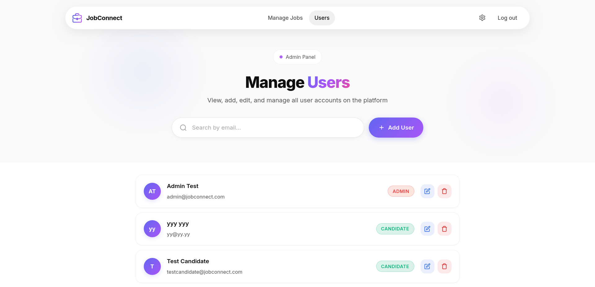
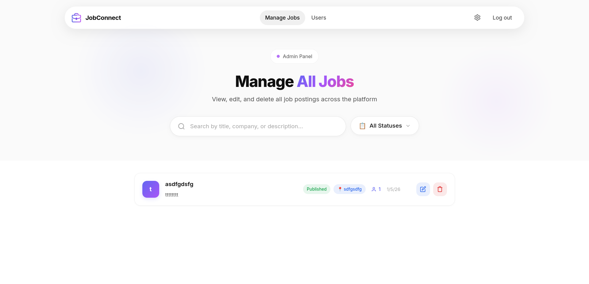
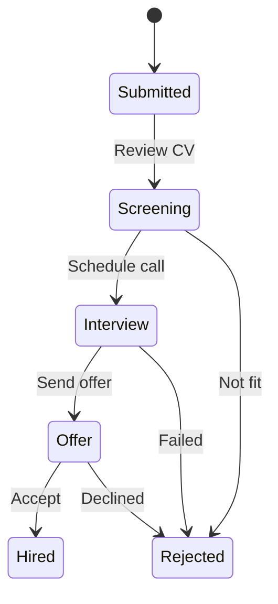

<p align="center">
  
</p>

<h1 align="center">JobConnect</h1>

<p align="center">
  <strong>A modern Applicant Tracking System (ATS) platform connecting candidates with companies</strong>
</p>

<p align="center">
  
  
  
  
</p>

---

## 📚 Documentation

| Document | Description |
|----------|-------------|
| [📘 Technical Report](REPORT.md) | Complete technical documentation including architecture, data models, and API reference |
| [🚀 Coolify Deployment Guide](COOLIFY_DEPLOYMENT.md) | Step-by-step guide for deploying JobConnect on Coolify |

---

## 📸 Screenshots

<table>
  <tr>
    <td width="50%">
      
      <p align="center"><em>Modern landing page with glassmorphism design</em></p>
    </td>
    <td width="50%">
      
      <p align="center"><em>Job listing with advanced filtering</em></p>
    </td>
  </tr>
  <tr>
    <td width="50%">
      
      <p align="center"><em>Dynamic CV builder with real-time preview</em></p>
    </td>
    <td width="50%">
      
      <p align="center"><em>Visual application status tracker</em></p>
    </td>
  </tr>
  <tr>
    <td width="50%">
      
      <p align="center"><em>Company dashboard with job management</em></p>
    </td>
    <td width="50%">
      
      <p align="center"><em>Drag-and-drop Kanban board for hiring pipeline</em></p>
    </td>
  </tr>
  <tr>
    <td width="50%">
      
      <p align="center"><em>Admin panel for managing all users</em></p>
    </td>
    <td width="50%">
      
      <p align="center"><em>Admin panel for managing all job postings</em></p>
    </td>
  </tr>
</table>

---

## ✨ Features

### 👤 For Candidates

| Feature | Description |
|---------|-------------|
| **CV Builder** | Dynamic profile builder with real-time preview. Add experience, education, certifications, and skills with instant autosave. |
| **Job Search** | Browse and filter jobs by title, location, job type, and required skills. |
| **One-Click Apply** | Apply to jobs with your saved profile. Your matching score is calculated automatically. |
| **Application Tracker** | Visual pipeline showing your application status: `Submitted → Screening → Interview → Offer → Hired` |
| **Skill Management** | Add skills with proficiency levels (1-5) and years of experience for better job matching. |

### 🏢 For Companies

| Feature | Description |
|---------|-------------|
| **Dashboard** | Overview of all job postings with status indicators and applicant counts. |
| **Job Management** | Create, edit, publish, and archive job postings with rich descriptions. |
| **Kanban Board** | Drag-and-drop candidates between hiring stages. Update multiple candidates at once. |
| **Candidate Profiles** | View detailed candidate profiles with experience, education, and skill match scores. |
| **AI-Powered Matching** | Algorithm calculates compatibility score based on required/optional skills and proficiency. |

### 🔧 For Administrators

| Feature | Description |
|---------|-------------|
| **User Management** | View, create, edit, and manage all user accounts (Candidates and Companies). |
| **Job Management** | Oversee all job postings across the platform with full CRUD capabilities. |
| **Platform Oversight** | Complete visibility into all platform activity and data. |

### 🔐 Authentication & Security

- JWT-based authentication with secure token refresh
- BCrypt password hashing
- Role-based access control (Candidate/Company/Admin)
- Protected API endpoints with authorization guards
- CORS configuration for secure cross-origin requests

---

## 📊 Matching Score Algorithm

The platform uses a sophisticated scoring algorithm to match candidates with job requirements:

```
┌─────────────────────────────────────────────────────────────────────┐
│                     MATCHING SCORE BREAKDOWN                        │
├─────────────────────────────────────────────────────────────────────┤
│                                                                     │
│   Base Score (70%)      =  Matched Required Skills                  │
│                            ─────────────────────── × 70             │
│                            Total Required Skills                    │
│                                                                     │
│   Optional Bonus (20%)  =  Matched Optional Skills                  │
│                            ──────────────────────── × 20            │
│                            Total Optional Skills                    │
│                                                                     │
│   Proficiency Bonus     =  (Candidate Level - Required Level) × 2   │
│   (Max 10%)                per matched skill                        │
│                                                                     │
├─────────────────────────────────────────────────────────────────────┤
│                     TOTAL SCORE: Max 100%                           │
└─────────────────────────────────────────────────────────────────────┘
```

**Example**: A job requires 4 skills (3 required, 1 optional). A candidate has 3 of the required skills with higher proficiency than minimum:

- Base Score: 3/3 × 70 = **70 points**
- Optional Bonus: 0/1 × 20 = **0 points**
- Proficiency Bonus: **+6 points** (exceeds requirements)
- **Total: 76%**

---

## 🚀 Quick Start

### Prerequisites

- [Docker](https://www.docker.com/) and Docker Compose
- [Node.js 20+](https://nodejs.org/) (for local development)
- [.NET 9 SDK](https://dotnet.microsoft.com/download) (for local development)

### Option 1: Run with Docker (Recommended)

```bash
# Clone the repository
git clone https://github.com/yourusername/JobConnect.git
cd JobConnect

# Copy environment variables
cp .env.example .env

# Start all services
docker-compose up --build
```

**Services will be available at:**

| Service | URL | Description |
|---------|-----|-------------|
| 🌐 **Frontend** | <http://localhost:4201> | Angular application |
| 🔌 **API** | <http://localhost:5001> | .NET REST API |
| 🐘 **Database** | localhost:5433 | PostgreSQL |
| 📊 **pgAdmin** | <http://localhost:5052> | Database management |

### Option 2: Local Development

**Backend (.NET API):**

```bash
cd JobConnect.API

# Restore dependencies
dotnet restore

# Run in development mode
dotnet run
```

**Frontend (Angular):**

```bash
cd jobconnect-frontend

# Install dependencies
npm install

# Start development server
npm start
```

---

## 🏗️ Architecture

```
JobConnect/
├── 📁 JobConnect.API/                 # .NET 9 Web API
│   ├── Controllers/
│   │   ├── AuthController.cs          # Registration, login, password management
│   │   ├── JobsController.cs          # Job CRUD operations
│   │   ├── CandidatesController.cs    # Candidate profile management
│   │   ├── CompaniesController.cs     # Company dashboard, kanban
│   │   ├── ApplicationsController.cs  # Job applications
│   │   └── SkillsController.cs        # Skills catalog
│   ├── Models/
│   │   ├── User.cs                    # User entity with roles
│   │   ├── CandidateProfile.cs        # CV data (JSON columns)
│   │   ├── Company.cs                 # Company profile
│   │   ├── JobPosting.cs              # Job with status lifecycle
│   │   ├── Application.cs             # Application with kanban order
│   │   └── Skill.cs                   # Skills with proficiency
│   ├── Services/
│   │   ├── AuthService.cs             # JWT token generation
│   │   └── MatchingScoreService.cs    # Score calculation algorithm
│   ├── Data/
│   │   └── ApplicationDbContext.cs    # EF Core context
│   └── DTOs/                          # Data transfer objects
│
├── 📁 jobconnect-frontend/            # Angular 21 SPA
│   └── src/app/
│       ├── core/
│       │   ├── guards/                # Route protection
│       │   ├── interceptors/          # HTTP interceptors
│       │   ├── models/                # TypeScript interfaces
│       │   └── services/              # API service layer
│       ├── features/
│       │   ├── auth/                  # Login, register
│       │   ├── landing/               # Home page
│       │   ├── jobs/                  # Job list, details
│       │   ├── candidate/
│       │   │   ├── cv-builder/        # Profile editor
│       │   │   └── application-tracker/
│       │   └── company/
│       │       ├── dashboard/         # Company overview
│       │       ├── job-create/        # Job posting form
│       │       ├── job-edit/          # Edit existing jobs
│       │       ├── candidates/        # Kanban board
│       │       └── candidate-profile-modal/
│       └── shared/                    # Reusable components
│
├── 📄 docker-compose.yml              # Container orchestration
├── 📄 .env.example                    # Environment template
└── 📄 README.md
```

### Tech Stack

| Layer | Technology | Purpose |
|-------|------------|---------|
| **Frontend** | Angular 21, Angular CDK | Modern SPA with drag-drop |
| **Styling** | SCSS, Glassmorphism | Premium liquid glass design |
| **Backend** | .NET 9, ASP.NET Core | RESTful API |
| **ORM** | Entity Framework Core | Database operations |
| **Database** | PostgreSQL 16 | Data persistence with JSONB |
| **Auth** | JWT + BCrypt | Secure authentication |
| **Container** | Docker Compose | Development environment |

---

## 📡 API Reference

### Authentication

| Method | Endpoint | Description | Auth |
|--------|----------|-------------|------|
| `POST` | `/api/auth/register` | Create new account | No |
| `POST` | `/api/auth/login` | Authenticate user | No |
| `PUT` | `/api/auth/change-email` | Update email | Yes |
| `PUT` | `/api/auth/change-password` | Update password | Yes |

### Jobs

| Method | Endpoint | Description | Auth |
|--------|----------|-------------|------|
| `GET` | `/api/jobs` | List published jobs (with filters) | No |
| `GET` | `/api/jobs/:id` | Get job details | No |
| `POST` | `/api/jobs` | Create job posting | Company |
| `PUT` | `/api/jobs/:id` | Update job | Company |
| `DELETE` | `/api/jobs/:id` | Delete job | Company |

### Candidates

| Method | Endpoint | Description | Auth |
|--------|----------|-------------|------|
| `GET` | `/api/candidates/profile` | Get own profile | Candidate |
| `PUT` | `/api/candidates/profile` | Update CV/profile | Candidate |
| `PUT` | `/api/candidates/profile/skills` | Update skills | Candidate |
| `GET` | `/api/candidates/applications` | List applications | Candidate |

### Companies

| Method | Endpoint | Description | Auth |
|--------|----------|-------------|------|
| `GET` | `/api/companies/profile` | Get company profile | Company |
| `PUT` | `/api/companies/profile` | Update company | Company |
| `GET` | `/api/companies/jobs` | List company's jobs | Company |
| `GET` | `/api/companies/jobs/:id/applications` | Get applicants | Company |
| `PUT` | `/api/companies/jobs/:id/applications/:appId/status` | Update status | Company |
| `POST` | `/api/companies/jobs/:id/kanban/reorder` | Reorder kanban | Company |

### Applications

| Method | Endpoint | Description | Auth |
|--------|----------|-------------|------|
| `POST` | `/api/applications` | Apply to job | Candidate |
| `GET` | `/api/applications/:id` | Get application details | Auth |

### Skills

| Method | Endpoint | Description | Auth |
|--------|----------|-------------|------|
| `GET` | `/api/skills` | List all skills | No |

---

## ⚙️ Environment Variables

Create a `.env` file based on `.env.example`:

```env
# Database Configuration
POSTGRES_DB=jobconnect
POSTGRES_USER=jobconnect
POSTGRES_PASSWORD=your_secure_password

# JWT Configuration
JWT_SECRET=YourSuperSecretKeyThatIsAtLeast32CharactersLong!

# CORS Configuration
CORS_ORIGINS=http://localhost:4200,http://localhost:4201

# pgAdmin (optional)
PGADMIN_EMAIL=admin@admin.com
PGADMIN_PASSWORD=admin123
```

---

## 📁 Data Models

### Application Status Flow



### Job Status Lifecycle

| Status | Description |
|--------|-------------|
| `Draft` | Job created but not visible to candidates |
| `Published` | Active and searchable |
| `Closed` | No longer accepting applications |
| `Archived` | Historical record |

### Proficiency Levels

| Level | Description |
|-------|-------------|
| 1 | Beginner - Basic understanding |
| 2 | Elementary - Limited experience |
| 3 | Intermediate - Practical application |
| 4 | Advanced - Deep knowledge |
| 5 | Expert - Industry leader |

---

## 🧪 Development

### Database Migrations

```bash
cd JobConnect.API

# Add a new migration
dotnet ef migrations add MigrationName

# Apply migrations
dotnet ef database update
```

### Database Seeding

The project includes a comprehensive data seeder that creates sample companies, job postings, candidates, and applications for testing and demonstration purposes.

**Seed only if database is empty:**

```bash
cd JobConnect.API
SEED_DATABASE=true dotnet run
```

**Force seed (add data even if database has existing data):**

```bash
cd JobConnect.API
SEED_DATABASE=true FORCE_SEED=true dotnet run
```

The seeder creates:

- **10 companies** with full profiles
- **50+ job postings** across various roles and types
- **32 candidates** with experience, education, and skills
- **100+ applications** across all statuses

> **Note**: Remove or set `SEED_DATABASE=false` after seeding to prevent the seeder from running on every startup.

### Running Tests

**Frontend:**

```bash
cd jobconnect-frontend
npm test
```

**Backend:**

```bash
cd JobConnect.API
dotnet test
```

---

## 🤝 Contributing

1. Fork the repository
2. Create a feature branch (`git checkout -b feature/amazing-feature`)
3. Commit your changes (`git commit -m 'Add amazing feature'`)
4. Push to the branch (`git push origin feature/amazing-feature`)
5. Open a Pull Request

---

<p align="center">
  Made with ❤️
</p>
